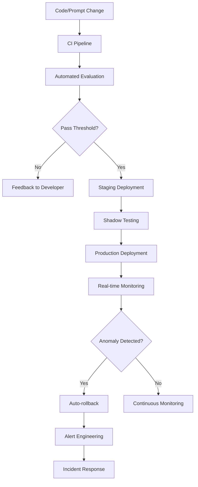

## Introduction

If you've ever deployed a language model to production, you know the nightmare: the model performs beautifully in your notebook, but once it hits traffic, hallucinations creep in, latency spikes, and you're left wondering what went wrong. Traditional MLOps practices don't map cleanly to LLM-based systems. Models aren't static artifacts anymore—they're dynamic, probabilistic, and constantly evolving with new prompts, fine-tunes, and retrieval strategies.

This is where LLMOps comes in. It's not just MLOps with a new name. The operational challenges around versioning prompts, evaluating non-deterministic outputs, and monitoring semantic drift require a fundamentally different toolkit. In this post, I'll walk through the three pillars of production LLM systems: CI/CD pipelines, evaluation frameworks, and monitoring strategies.

## Why LLMOps Is Different from Traditional MLOps

Before diving into the how, let's understand the why. Traditional ML models have deterministic outputs given the same inputs. A fraud detection model trained on last year's data will produce the same prediction today if fed the same features. LLMs are different. They're non-deterministic by nature, their outputs depend on prompt context, temperature settings, and retrieval augmentation. The "model" in an LLM application is often just one component—prompts, vector stores, tool definitions, and guardrails all play roles.

This means your CI/CD pipeline isn't just about deploying code. It's about deploying prompt versions, evaluating semantic quality, and ensuring that changes to any component don't degrade the system. The evaluation metrics themselves shift from accuracy and F1 scores to human-aligned quality measures like faithfulness, relevance, and coherence.

## Building CI/CD Pipelines for LLM Applications

### The Pipeline Architecture

A production LLM pipeline needs to handle several distinct artifacts: model weights, prompt templates, retrieval configurations, and application code. Let me show you a practical pipeline structure using GitHub Actions.

```yaml
name: LLMOps Pipeline

on:
  push:
    branches: [main]
  pull_request:
    branches: [main]

jobs:
  evaluate:
    runs-on: ubuntu-latest
    steps:
      - uses: actions/checkout@v4
      
      - name: Setup Python
        uses: actions/setup-python@v5
        with:
          python-version: '3.11'
      
      - name: Install dependencies
        run: pip install -r requirements.txt
      
      - name: Run evaluation suite
        env:
          OPENAI_API_KEY: ${{ secrets.OPENAI_API_KEY }}
          HF_TOKEN: ${{ secrets.HF_TOKEN }}
        run: python scripts/evaluate.py
      
      - name: Check evaluation thresholds
        run: python scripts/check_thresholds.py
        env:
          MIN_FAITHFULNESS: 0.85
          MIN_RELEVANCE: 0.80
      
      - name: Upload evaluation report
        uses: actions/upload-artifact@v4
        with:
          name: eval-report
          path: outputs/evaluation_report.json

  deploy:
    needs: evaluate
    runs-on: ubuntu-latest
    if: github.ref == 'refs/heads/main'
    steps:
      - uses: actions/checkout@v4
      
      - name: Deploy to production
        run: ./scripts/deploy.sh
        env:
          KUBECONFIG: ${{ secrets.KUBECONFIG }}
          MODEL_VERSION: ${{ github.sha }}
```

### Prompt Versioning and Management

One of the most critical aspects of LLM CI/CD is prompt versioning. Unlike code, prompts are often edited directly in production without proper tracking. Implement a prompt registry that treats prompts as first-class artifacts.

```python
# prompts/registry.py
import json
from pathlib import Path
from datetime import datetime
from dataclasses import dataclass
from typing import Optional

@dataclass
class PromptVersion:
    id: str
    template: str
    parameters: dict
    version: int
    created_at: datetime
    author: str
    eval_score: Optional[float] = None


class PromptRegistry:
    def __init__(self, registry_path: Path = Path("prompts/registry.json")):
        self.registry_path = registry_path
        self.prompts: dict[str, list[PromptVersion]] = {}
        self._load()
    
    def register(
        self,
        name: str,
        template: str,
        parameters: dict,
        author: str
    ) -> PromptVersion:
        if name not in self.prompts:
            self.prompts[name] = []
        
        current_versions = self.prompts[name]
        next_version = len(current_versions) + 1
        
        version = PromptVersion(
            id=f"{name}-v{next_version}",
            template=template,
            parameters=parameters,
            version=next_version,
            created_at=datetime.utcnow(),
            author=author
        )
        
        self.prompts[name].append(version)
        self._save()
        return version
    
    def get_latest(self, name: str) -> PromptVersion:
        versions = self.prompts.get(name, [])
        if not versions:
            raise ValueError(f"Prompt {name} not found")
        return max(versions, key=lambda v: v.version)
```

### Automated Prompt Testing

Your CI pipeline should run automated tests against every prompt change. Use a golden dataset of input-output pairs and verify that new prompt versions maintain or improve quality.

```python
# tests/test_prompts.py
import pytest
from prompts.registry import PromptRegistry
from evaluation.metrics import faithfulness, relevance, coherence

registry = PromptRegistry()

@pytest.mark.parametrize("test_case", [
    ("customer-support-q1", "How do I reset my password?", "password-reset"),
    ("customer-support-q2", "I need to cancel my subscription", "subscription-cancel"),
    ("technical-faq-q1", "What's the difference between REST and GraphQL?", "api-concepts"),
])
def test_prompt_response_quality(test_id, question, expected_category):
    prompt = registry.get_latest("customer-support")
    
    # Generate response using your LLM
    response = generate_response(prompt, question)
    
    # Evaluate against multiple dimensions
    assert faithfulness(response, question) >= 0.85
    assert relevance(response, question) >= 0.80
    assert response.category == expected_category
```

## Evaluation Frameworks for LLM Applications

### The Multi-Dimensional Evaluation Problem

Evaluating LLMs requires measuring multiple dimensions simultaneously. A response might be factually correct but poorly formatted, or creative but irrelevant. Traditional ML evaluation metrics don't capture this complexity.

Here's a comprehensive evaluation framework that covers the key dimensions:

```python
# evaluation/evaluator.py
from typing import Dict, Any
from dataclasses import dataclass
from enum import Enum

class EvalDimension(Enum):
    FAITHFULNESS = "faithfulness"
    RELEVANCE = "relevance"
    COHERENCE = "coherence"
    SAFETY = "safety"
    HELPFULNESS = "helpfulness"

@dataclass
class EvaluationResult:
    dimension: EvalDimension
    score: float
    rationale: str
    metadata: Dict[str, Any]

class LLM evaluator:
    def __init__(self, evaluator_model: str = "gpt-4o"):
        self.evaluator_model = evaluator_model
        self.dimension_evaluators = {
            EvalDimension.FAITHFULNESS: self._evaluate_faithfulness,
            EvalDimension.RELEVANCE: self._evaluate_relevance,
            EvalDimension.COHERENCE: self._evaluate_coherence,
            EvalDimension.SAFETY: self._evaluate_safety,
            EvalDimension.HELPFULNESS: self._evaluate_helpfulness,
        }
    
    def evaluate(
        self,
        question: str,
        response: str,
        context: str = ""
    ) -> Dict[EvalDimension, EvaluationResult]:
        results = {}
        for dimension, evaluator in self.dimension_evaluators.items():
            results[dimension] = evaluator(question, response, context)
        return results
    
    def _evaluate_faithfulness(
        self,
        question: str,
        response: str,
        context: str
    ) -> EvaluationResult:
        """Check if response is grounded in the provided context."""
        prompt = f"""
        Evaluate the faithfulness of this response.
        Question: {question}
        Context: {context}
        Response: {response}
        
        Score from 0-1 how well the response is supported by the context.
        Return JSON: {{"score": float, "rationale": str}}
        """
        # Implementation calls LLM for evaluation
        return EvaluationResult(
            dimension=EvalDimension.FAITHFULNESS,
            score=0.92,
            rationale="Response accurately reflects context",
            metadata={}
        )
    
    def _evaluate_relevance(
        self,
        question: str,
        response: str,
        context: str
    ) -> EvaluationResult:
        """Check if response addresses the question."""
        # Similar implementation...
        return EvaluationResult(
            dimension=EvalDimension.RELEVANCE,
            score=0.88,
            rationale="Response directly answers the question",
            metadata={}
        )
    
    # ... other dimension evaluators
```

### RAG-Specific Evaluation

If you're building retrieval-augmented generation systems, you need specialized evaluation for both the retrieval and generation components.

```python
# evaluation/rag_evaluator.py
from typing import List, Tuple

class RAGEvaluator:
    def __init__(self):
        self.retrieval_eval = RetrievalEvaluator()
        self.generation_eval = GenerationEvaluator()
    
    def evaluate_rag_pipeline(
        self,
        query: str,
        expected_answer: str,
        retrieved_documents: List[str],
        generated_response: str
    ) -> Dict[str, Any]:
        # Evaluate retrieval quality
        retrieval_metrics = self.retrieval_eval.evaluate(
            query, retrieved_documents, expected_answer
        )
        
        # Evaluate generation quality
        generation_metrics = self.generation_eval.evaluate(
            query, generated_response, retrieved_documents
        )
        
        return {
            "retrieval": retrieval_metrics,
            "generation": generation_metrics,
            "end_to_end": {
                "answer_accuracy": self._calculate_accuracy(
                    generated_response, expected_answer
                ),
                "hallucination_score": self._detect_hallucinations(
                    generated_response, retrieved_documents
                )
            }
        }

class RetrievalEvaluator:
    """Evaluate retrieval component using standard IR metrics."""
    
    def evaluate(
        self,
        query: str,
        documents: List[str],
        relevant_doc: str
    ) -> Dict[str, float]:
        return {
            "recall_at_k": self._recall_at_k(documents, relevant_doc, k=5),
            "precision_at_k": self._precision_at_k(documents, relevant_doc, k=5),
            "ndcg": self._ndcg(documents, relevant_doc),
            "mrr": self._mean_reciprocal_rank(documents, relevant_doc)
        }
```

### Human-in-the-Loop Evaluation

Automated evaluation has limitations. For critical applications, implement human evaluation pipelines that sample responses for expert review.

```python
# evaluation/human_review.py
import uuid
from datetime import datetime
from typing import Optional

class HumanReviewPipeline:
    def __init__(self, review_threshold: float = 0.7):
        self.review_threshold = review_threshold
    
    def should_review(
        self,
        eval_scores: Dict[str, float],
        confidence: float
    ) -> bool:
        """Determine if human review is needed."""
        avg_score = sum(eval_scores.values()) / len(eval_scores)
        
        # Flag for review if:
        # 1. Average score below threshold
        # 2. High confidence but low score (unexpected)
        # 3. Any single dimension critically low
        critical_dimensions = [s < 0.5 for s in eval_scores.values()]
        
        return (
            avg_score < self.review_threshold or
            any(critical_dimensions)
        )
    
    def create_review_task(
        self,
        question: str,
        response: str,
        eval_scores: Dict[str, float]
    ) -> dict:
        return {
            "task_id": str(uuid.uuid4()),
            "created_at": datetime.utcnow().isoformat(),
            "question": question,
            "response": response,
            "auto_scores": eval_scores,
            "status": "pending_review",
            "priority": self._calculate_priority(eval_scores)
        }
```

## Production Monitoring Strategies

### The Monitoring Stack

Production LLM systems need monitoring at multiple layers: infrastructure, application, and model performance. Here's a comprehensive monitoring setup using Prometheus and Grafana.

```yaml
# monitoring/prometheus.yml
global:
  scrape_interval: 15s

scrape_configs:
  - job_name: 'llm-service'
    metrics_path: '/metrics'
    static_configs:
      - targets: ['llm-service:8080']
    metric_relabel_configs:
      - source_labels: [__name__]
        regex: 'llm_.*'
        action: keep

  - job_name: 'llm-exporter'
    static_configs:
      - targets: ['llm-exporter:9100']
```

```python
# monitoring/metrics.py
from prometheus_client import Counter, Histogram, Gauge, generate_latest
from prometheus_client import start_http_server
import time
from typing import Dict, Any

class LLMMetrics:
    def __init__(self):
        # Request metrics
        self.request_count = Counter(
            'llm_request_count',
            'Total LLM requests',
            ['model', 'endpoint', 'status']
        )
        
        self.request_latency = Histogram(
            'llm_request_latency_seconds',
            'LLM request latency',
            ['model', 'endpoint'],
            buckets=[0.1, 0.5, 1.0, 2.0, 5.0, 10.0]
        )
        
        self.token_usage = Histogram(
            'llm_token_usage',
            'Token usage per request',
            ['model', 'usage_type'],
            buckets=[100, 500, 1000, 5000, 10000, 50000]
        )
        
        # Quality metrics
        self.quality_score = Gauge(
            'llm_quality_score',
            'Average quality score from evaluations',
            ['dimension', 'model']
        )
        
        # Error metrics
        self.error_count = Counter(
            'llm_error_count',
            'LLM errors',
            ['error_type', 'model']
        )
        
        # Business metrics
        self.user_satisfaction = Gauge(
            'llm_user_satisfaction',
            'User satisfaction score (1-5)',
            ['feature']
        )
    
    def record_request(
        self,
        model: str,
        endpoint: str,
        latency: float,
        input_tokens: int,
        output_tokens: int,
        success: bool
    ):
        status = 'success' if success else 'error'
        self.request_count.labels(model, endpoint, status).inc()
        self.request_latency.labels(model, endpoint).observe(latency)
        self.token_usage.labels(model, 'input').observe(input_tokens)
        self.token_usage.labels(model, 'output').observe(output_tokens)
        
        if not success:
            self.error_count.labels('request_error', model).inc()
```

### Anomaly Detection

LLM outputs can degrade gradually. Implement anomaly detection to catch performance drifts before they impact users.

```python
# monitoring/anomaly_detection.py
import numpy as np
from collections import deque
from typing import Dict, List

class PerformanceAnomalyDetector:
    def __init__(self, window_size: int = 1000, threshold: float = 2.0):
        self.window_size = window_size
        self.threshold = threshold
        self.metrics: Dict[str, deque] = {}
    
    def add_metric(self, name: str, value: float):
        if name not in self.metrics:
            self.metrics[name] = deque(maxlen=self.window_size)
        self.metrics[name].append(value)
    
    def detect_anomaly(self, name: str) -> Dict[str, Any]:
        values = list(self.metrics.get(name, []))
        
        if len(values) < 100:
            return {"anomaly": False, "reason": "insufficient_data"}
        
        mean = np.mean(values)
        std = np.std(values)
        current = values[-1]
        
        z_score = abs(current - mean) / std if std > 0 else 0
        
        return {
            "anomaly": z_score > self.threshold,
            "z_score": z_score,
            "mean": mean,
            "std": std,
            "current": current,
            "direction": "increase" if current > mean else "decrease"
        }
    
    def get_trend(self, name: str, lookback: int = 100) -> str:
        values = list(self.metrics.get(name, []))
        if len(values) < lookback:
            return "insufficient_data"
        
        recent = values[-lookback:]
        older = values[:-lookback]
        
        recent_mean = np.mean(recent)
        older_mean = np.mean(older)
        
        change = (recent_mean - older_mean) / older_mean if older_mean != 0 else 0
        
        if abs(change) < 0.05:
            return "stable"
        elif change > 0:
            return "improving"
        else:
            return "degrading"
```

### Real-Time Alerting

Set up intelligent alerting that distinguishes between transient issues and systemic problems.

```yaml
# monitoring/alertmanager.yml
global:
  resolve_timeout: 5m

route:
  group_by: ['alertname', 'model']
  group_wait: 30s
  group_interval: 5m
  repeat_interval: 4h
  receiver: 'slack-notifications'
  routes:
    - match:
        severity: 'critical'
      receiver: 'pagerduty'
      repeat_interval: 1h
    - match:
        severity: 'warning'
      receiver: 'slack-notifications'

receivers:
  - name: 'slack-notifications'
    slack_configs:
      - channel: '#llm-alerts'
        send_resolved: true
        title: '{{ .CommonAnnotations.summary }}'
        text: '{{ .CommonAnnotations.description }}'

  - name: 'pagerduty'
    pagerduty_configs:
      - service_key: '{{ secrets.PAGERDUTY_KEY }}'
```

```python
# monitoring/alerts.py
from typing import List, Dict
import asyncio

class AlertManager:
    def __init__(self, anomaly_detector: PerformanceAnomalyDetector):
        self.detector = anomaly_detector
        self.active_alerts: Dict[str, Dict] = {}
    
    async def check_and_alert(self, metric_name: str):
        anomaly = self.detector.detect_anomaly(metric_name)
        trend = self.detector.get_trend(metric_name)
        
        if anomaly["anomaly"]:
            alert_key = f"{metric_name}_{anomaly['direction']}"
            
            if alert_key not in self.active_alerts:
                alert = {
                    "metric": metric_name,
                    "severity": self._determine_severity(anomaly, trend),
                    "message": self._format_message(anomaly, trend),
                    "timestamp": asyncio.get_event_loop().time(),
                    "z_score": anomaly["z_score"]
                }
                
                self.active_alerts[alert_key] = alert
                await self._send_alert(alert)
        else:
            # Clear alert if anomaly resolved
            alert_key = f"{metric_name}_{'increase' if trend == 'improving' else 'decrease'}"
            if alert_key in self.active_alerts:
                del self.active_alerts[alert_key]
    
    def _determine_severity(self, anomaly: Dict, trend: str) -> str:
        z_score = anomaly["z_score"]
        
        if z_score > 4:
            return "critical"
        elif z_score > 3:
            return "high"
        elif trend == "degrading" and z_score > 2:
            return "warning"
        return "info"
    
    def _format_message(self, anomaly: Dict, trend: str) -> str:
        return (
            f"Anomaly detected in {anomaly.get('metric', 'unknown')}: "
            f"Z-score {anomaly['z_score']:.2f}, trend: {trend}. "
            f"Current value: {anomaly['current']:.4f}, "
            f"Mean: {anomaly['mean']:.4f}"
        )
```

## Putting It All Together

### The Complete LLMOps Workflow

Here's how all these components work together in a production environment:



### Best Practices Summary

1. **Version everything**: Prompts, models, configurations, and datasets. Never deploy without a traceable version.

2. **Evaluate continuously**: Don't just evaluate at deployment time. Run evaluations on production traffic samples to catch drift.

3. **Set meaningful thresholds**: Base your evaluation thresholds on business requirements, not arbitrary numbers. A 0.85 faithfulness score might be perfect for a chatbot but unacceptable for medical advice.

4. **Monitor the full stack**: Track infrastructure metrics, application performance, and model quality separately. They often have different failure modes.

5. **Implement graceful degradation**: When evaluation scores drop, have fallback mechanisms—simpler models, cached responses, or human handoff.

6. **Collect feedback loops**: Enable users to rate responses and feed that data back into your evaluation and training pipelines.

7. **Document your SLOs**: Define Service Level Objectives for latency, availability, and quality. Monitor them explicitly.

## Key Takeaways

- **LLMOps requires a different mindset** from traditional MLOps. Prompts, retrieval configurations, and model weights are all first-class artifacts that need versioning and testing.

- **CI/CD for LLMs means testing more than code**. Your pipeline should validate prompt changes against golden datasets, check evaluation metrics, and only deploy when quality thresholds are met.

- **Evaluation is multi-dimensional**. Faithfulness, relevance, coherence, safety, and helpfulness all matter. Use automated evaluators for speed, but incorporate human review for critical decisions.

- **RAG systems need specialized evaluation**. Separate retrieval metrics (recall, precision, NDCG) from generation metrics (faithfulness, hallucination detection).

- **Production monitoring must catch drift**. Implement anomaly detection on quality metrics, not just latency and error rates. Gradual degradation is harder to spot than sudden failures.

- **Alerting should be intelligent**. Distinguish between transient issues and systemic problems. Auto-rollback on critical anomalies, but don't alert on every blip.

- **The feedback loop is essential**. Production data should continuously improve your evaluation datasets and models. Without this loop, your system will stagnate.

Building production LLM systems is hard. But with proper CI/CD, evaluation, and monitoring practices, you can ship with confidence and catch problems before they reach users. The investment in LLMOps infrastructure pays off in reliability, maintainability, and the ability to iterate quickly on your AI features.